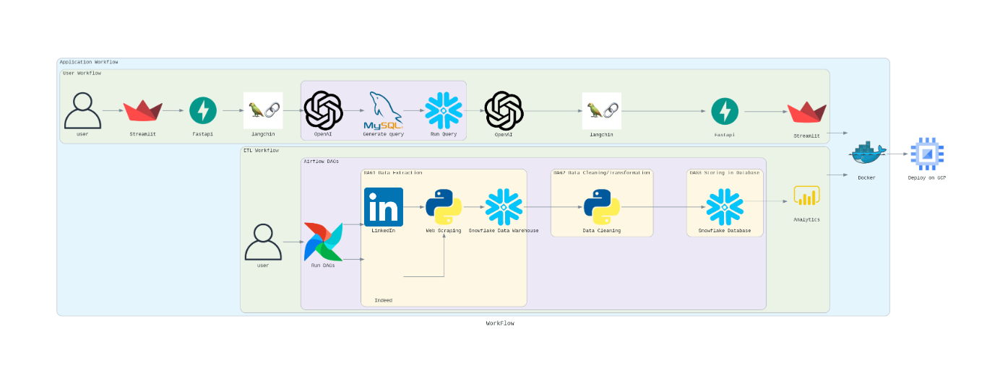

# Crafting Intelligence through Analytics

[](https://streamlit.io/)
[](https://github.com/)
[](https://fastapi.tiangolo.com/)
[](https://aws.amazon.com/)
[](https://www.python.org/)
[](https://developer.mozilla.org/en-US/docs/Web/Guide/HTML/HTML5)
[](https://pandas.pydata.org/)
[](https://airflow.apache.org/)
[](https://github.com/features/actions)
[](https://www.docker.com)
[](https://cloud.google.com)
[](https://platform.openai.com/docs/api-reference/introduction)
[](https://www.postgresql.org)
[
](https://www.snowflake.com/en/?_ga=2.41504805.669293969.1706151075-1146686108.1701841103&_gac=1.160808527.1706151104.Cj0KCQiAh8OtBhCQARIsAIkWb68j5NxT6lqmHVbaGdzQYNSz7U0cfRCs-STjxZtgPcZEV-2Vs2-j8HMaAqPsEALw_wcB)

## Description:

This project entails the integration of Airflow, Docker, FastAPI, and Streamlit to create a robust end-to-end solution for job-related information retrieval and interaction. The primary scope involves utilizing web scraping tools and techniques to extract relevant job data from LinkedIn. The Airflow framework will be employed to orchestrate and schedule the scraping process, ensuring timely updates and data freshness. Docker containers will facilitate seamless deployment and scalability of the application. FastAPI will be leveraged to build a RESTful API, enabling efficient communication between components. Streamlit, as a user interface framework, will be employed to create an interactive front-end for end-users to engage with the chatbot.

In addition to web scraping, natural language processing (NLP) and machine learning technologies will be integrated to refine and process the extracted job information. These technologies will empower the language model within the chatbot, enhancing its ability to understand, generate, and respond to job-related queries with contextual accuracy.

Expected deliverables encompass a comprehensive dataset of job-related information sourced from LinkedIn, a scalable and containerized application architecture using Docker, a well-orchestrated workflow managed by Airflow, a RESTful API developed with FastAPI for seamless communication, and a user-friendly, interactive interface powered by Streamlit. The integration of NLP and machine learning will contribute to the sophistication of the language model, ensuring a more nuanced and context-aware interaction.

# Documentation 

https://codelabs-preview.appspot.com/?file_id=1GVe4XklsT6N0e93yg0l9sDfO9t4QZt_kTUTZKDf3di4#0


# Logo:


# Architecture:



# About:
The project aims to provide a seamless, efficient, and user-centric solution for job-related inquiries while maintaining ethical standards in data retrieval and processing by scraping jobs from LinkedIn

Scope:
This project entails the integration of Airflow, Docker, FastAPI, and Streamlit to create a robust end-to-end solution for job-related information retrieval and interaction. The primary scope involves utilizing web scraping tools and techniques to extract relevant job data from LinkedIn. The Airflow framework will be employed to orchestrate and schedule the scraping process, ensuring timely updates and data freshness. Docker containers will facilitate seamless deployment and scalability of the application. FastAPI will be leveraged to build a RESTful API, enabling efficient communication between components. Streamlit, as a user interface framework, will be employed to create an interactive front-end for end-users to engage with the chatbot.

In addition to web scraping, natural language processing (NLP) and machine learning technologies will be integrated to refine and process the extracted job information. These technologies will empower the language model within the chatbot, enhancing its ability to understand, generate, and respond to job-related queries with contextual accuracy.

Expected deliverables encompass a comprehensive dataset of job-related information sourced from LinkedIn, a scalable and containerized application architecture using Docker, a well-orchestrated workflow managed by Airflow, a RESTful API developed with FastAPI for seamless communication, and a user-friendly, interactive interface powered by Streamlit. The integration of NLP and machine learning will contribute to the sophistication of the language model, ensuring a more nuanced and context-aware interaction.


# Process Outline:
**1.Data Extraction with Selenium and Apache Airflow:**
Selenium is utilized to automate web scraping on Indeed, enabling the extraction of up-to-date job information. Apache Airflow schedules and manages the daily execution of the extraction process, ensuring regular data updates and maintaining the relevance of the extracted data.

**2.Storage in Snowflake Data Warehouse:**
Snowflake, a cloud-based data warehouse, is chosen for its scalability, ease of use, and efficient storage capabilities. Storing raw data in Snowflake allows for centralized and secure data management.

**3.Data Cleaning with Python:**
Python scripts are employed to clean and preprocess the raw data obtained from Indeed. Data cleaning involves handling missing values, standardizing formats, and resolving inconsistencies to ensure data quality.

**4.ETL Process with Apache Airflow:**
Apache Airflow is now used for the Extract, Transform, Load (ETL) process, replacing PySpark. It orchestrates and schedules the ETL tasks, transforming the cleaned data into a format suitable for analysis. Transformation tasks may include data aggregation, filtering, and feature engineering to enhance the data's analytical value.

**5.Appending Processed Data to Snowflake:**
The transformed data is appended to the Snowflake data warehouse, creating a consolidated repository of structured and processed information. Snowflake's architecture supports seamless data integration, making it an ideal choice for ETL processes.

**6. User Interface:** Build a web application using Streamlit to provide an intuitive interface for job seekers to search and explore the Jobs, Resume Parsing Feature & Networking Feature.

**7. Testing:** Use pytest for unit testing to ensure the functionality of the application and its components.

**8. Deployment:** Host the application in cloud and deploy it using Airflow and a GCP instance.

**7. CI/CD:** GitHub Actions for automating the testing and deployment processes, ensuring code quality


## Project Tree

```
📦 
├─ .devcontainer
│  └─ config
├─ .github
│  └─ workflows
│     └─ ci_cd.yml
├─ .gitignore
├─ Architecture.png
├─ LICENSE
├─ Login.py
├─ Makefile
├─ README.md
├─ airflow
│  ├─ .gitignore
│  ├─ dags
│  │  ├─ Pipeline1.py
│  │  └─ Pipeline2.py
│  └─ docker-compose.yaml
├─ chain.py
├─ deploy_cita.py
├─ environment.yml
├─ fast_api
│  ├─ Dockerfile
│  ├─ docker-compose.yaml
│  ├─ requirements.txt
│  └─ user_registration.py
├─ image.jpg
├─ pages
│  ├─ 1_Register.py
│  ├─ AskMe.py
│  ├─ Charts.py
│  ├─ NetworkAI.py
│  ├─ Upgrade_subscription.py
│  ├─ image.jpg
│  └─ quotes.txt
├─ requirements.txt
├─ snowflake_connect.py
├─ snowflake_processes
│  ├─ 01_new_setup.sql
│  ├─ 02_loading_data.sql
│  ├─ requirements.txt
│  └─ teardown.sql
├─ template.py
└─ ui
   ├─ streamlit_ui.py
   └─ styles.md
```

## How to run Application locally

To run the application locally, follow these steps:

1. Clone the repository to get all the source code on your machine.

2. Use make install, make server, make streamlit to create the environment.

3. Create a .env file in the root directory with the following variables:

```
#Openai
OPENAI_API="Your_Secret_Key"
STRIPE_API_KEY="Your_Secret_Key"

# Snowflake 
SNOWFLAKE_ACCOUNT=""
SNOWFLAKE_USER=""
SNOWFLAKE_PASSWORD=""
SNOWFLAKE_ROLE=""
SNOWFLAKE_WAREHOUSE=""
SNOWFLAKE_DATABASE=""
SNOWFLAKE_TABLE=""

# Postgres
POSTGRES_USER=""
POSTGRES_PASSWORD=""
POSTGRES_HOST=""
POSTGRES_PORT="5432"
POSTGRES_DB=""
HOST_IP_ADDRESS=""

# email
MY_EMAIL=""
APP_PASSWORD=""

# Airflow
AIRFLOW_VAR_AWS_ACCESS_KEY1=""
AIRFLOW_VAR_AWS_SECRET_KEY1=""
AIRFLOW_VAR_S3_BUCKET_NAME1=""
AIRFLOW_VAR_AWS_REGION1=""

AIRFLOW_VAR_AWS_ACCESS_KEY=""
AIRFLOW_VAR_AWS_SECRET_KEY=""
AIRFLOW_VAR_S3_BUCKET_NAME=""
AIRFLOW_VAR_AWS_REGION=""
```

4. Once you have set up your environment variables, use make streamlit to run the application

5. Access the Airflow UI by navigating to http://localhost:8080/ in your web browser.

6. To run the DAGs in Airflow, click on the dags links on the Airflow UI and toggle the switch to enable the DAGs.

7. Once the DAGs have run successfully, view the Streamlit application

8. Access the Streamlit UI by navigating to http://localhost:8501/ in your web browser.

9. Enter username and password if you've already logged in. Otherwise you can register yourself and then run the application.


# Application Setup

### Create virtual environment
```
make install
```

### Run FastAPI server

```
make runserver
```

### Run streamlit application

```
make streamlit
```

# Database Setup

Create Table
```
CREATE TABLE users (
    id SERIAL PRIMARY KEY,
    username VARCHAR(255) UNIQUE,
    full_name VARCHAR(255),
    email VARCHAR(255) UNIQUE,
    hashed_password VARCHAR(255),
    active BOOLEAN DEFAULT TRUE,
    created_at TIMESTAMP DEFAULT NOW()
);
```

Create user role
```
CREATE USER admin WITH PASSWORD 'password';
```

Grant necessary privileges for generating primary key values
```
GRANT USAGE, SELECT ON SEQUENCE users_id_seq TO admin;
```

Admin role can perform all CRUD operations
```
GRANT SELECT, INSERT, UPDATE, DELETE ON users TO admin;
```

## License
This project is licensed under the MIT License.
